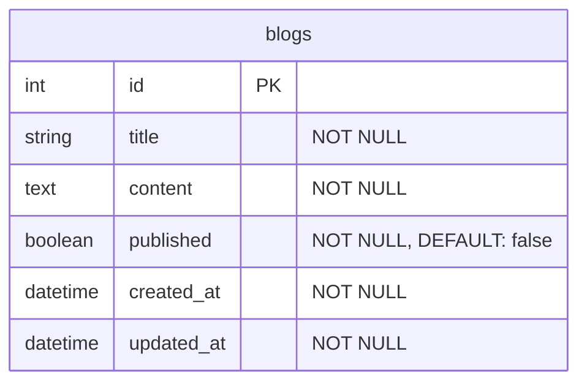

# 実際にModel specsを書いてみよう
本章からは、Ruby on Railsで書いたアプリケーションコードのロジックに対してテストを書いていきます。
以下のリポジトリをcloneもしくはforkして下さい。
https://github.com/sho-work/rspec-rails-sample
まずはBlogモデルのModels specを書いてみましょう。

:::message alert
この章と次の章では、
Ruby on Railsで書いたアプリケーションコードのロジックに対してテストを書いていきますが、
**Ruby on Rails等の使用するライブラリについては詳細に説明しません。**
参考リンク等は適宜添付するので、そちらを参照ください。
:::

## 前提の説明

### 今回使用するテーブルとモデル
以下は今回使用するサンプルアプリケーションに出てくるテーブルとモデルクラスです。

#### テーブル


#### モデル
（みやすくするためにコメントは削除して引用しています。）

```ruby
class Blog < ApplicationRecord
  validates :title, presence: true
  validates :content, presence: true

  scope :published, -> { where(published: true) }
  scope :unpublished, -> { where(published: false) }

  def self.filter_by_title(title)
    return current_scope if title.blank?

    sanitized_title = sanitize_sql_for_conditions(["title LIKE ?", "%#{title}%"])
    where(sanitized_title)
  end

  def self.filter_by_status(status)
    case status
    when 'published'
      published
    when 'unpublished'
      unpublished
    else
      current_scope
    end
  end
end
```

Github上のリンク:

https://github.com/sho-work/rspec-rails-sample/blob/5233cc918daad8904c6b9ef8d15a797eb9e444d5/src/app/models/blog.rb

## FactoryBotについて
今回Model specsを書く際に、テストデータを作成するためにFactoryBotを使用します。FactoryBotは、テスト用のオブジェクトを簡単に作成できるライブラリです。
https://github.com/thoughtbot/factory_bot

### FactoryBotの基本概念
FactoryBotは、テストで必要なデータを簡単に作成するためのツールです。手動でデータを作成する代わりに、テンプレートを使って自動的にデータを生成できます。

#### Factory（ファクトリー）
テスト用のオブジェクトを作成するための「設計図」のようなものです。
```ruby
# 例：ブログを作成するための設計図
factory :blog do
  title { "テストブログ" }
  content { "テスト内容" }
  published { false }
end
```

#### Trait（トレイト）
特定の条件のオブジェクトを作成するための「追加設定」です。同じFactoryをベースに、異なるバリエーションを作れます。
```ruby
# 例：公開済みのブログを作成するための追加設定
trait :published do
  published { true }
end

# 使用例
create(:blog)           # 通常のブログ（published: false）
create(:blog, :published) # 公開済みのブログ（published: true）
```

#### Sequence（シーケンス）
同じテストを複数回実行しても、一意の値を持つオブジェクトを作成する仕組みです。
```ruby
# 例：タイトルに連番を付ける
sequence(:title) { |n| "ブログタイトル #{n}" }

# 実行結果
# 1回目: "ブログタイトル 1"
# 2回目: "ブログタイトル 2"
# 3回目: "ブログタイトル 3"
```

### Blogモデル用のFactory
```ruby
FactoryBot.define do
  factory :blog do
    sequence(:title) { |n| "Blog Title #{n}" }
    content { "This is a sample blog content." }
    published { false }

    trait :published do
      published { true }
    end

    trait :unpublished do
      published { false }
    end
  end
end
```

このFactoryを一つずつ解説すると以下のようになります。
- `sequence(:title)`: 各テストで連番のタイトルを生成します。（Blog Title 1, Blog Title 2, ...）
- `content`: デフォルトのコンテンツを設定しています。FactoryBotでbuild/createする際に特に属性を指定しなければ設定した値になります。
- `published`: デフォルトでfalseに設定しています。FactoryBotでbuild/createする際に特に属性を指定しなければ設定した値になります。
- `trait :published`: publishedがtrueのブログを作成するためのtraitです。
- `trait :unpublished`: publishedがfalseのブログを作成するためのtraitです。

## 何を検証するべきか？

chapter2で説明したように、テストコードでは以下の2つの観点から検証を行います。

* **アウトプットのテスト**
* **副作用の検証**

この観点をBlogモデルのspecにも当てはめると、以下のようなことを検証するといいでしょう。

### バリデーションのテスト
- **アウトプットのテスト**: `valid?`メソッドの返り値（boolean）の検証
- **副作用の検証**: `blog.errors`に格納されたバリデーションエラーの検証(`blog.errors`という状態を持つものに対して副作用を与えていると言える。)

### スコープのテスト
- **アウトプットのテスト**: スコープメソッドの返り値（ActiveRecord::Relation）の検証
- **副作用の検証**: 副作用は発生していないのでなし。

### クラスメソッドのテスト
- **アウトプットのテスト**: メソッドの返り値の検証
- **副作用の検証**: 副作用は発生していないのでなし。

## BlogのModels specを書いてみよう！

以下はBlogモデルのspec例です。
コード例の後に解説します。
```ruby
require 'rails_helper'

RSpec.describe Blog, type: :model do
  describe 'validations' do
    context 'when all attributes are valid' do
      let(:blog) { build(:blog) }

      it 'is valid' do
        is_valid = blog.valid?
        expect(is_valid).to be true
      end
    end

    context 'when title is blank' do
      let(:blog) { build(:blog, title: nil) }

      it 'is invalid' do
        is_valid = blog.valid?
        expect(is_valid).to be false
        expect(blog.errors[:title]).to include("can't be blank")
      end
    end

    context 'when content is blank' do
      let(:blog) { build(:blog, content: nil) }

      it 'is invalid' do
        is_valid = blog.valid?
        expect(is_valid).to be false
        expect(blog.errors[:content]).to include("can't be blank")
      end
    end
  end

  describe 'scopes' do
    let!(:published_blog) { create(:blog, :published) }
    let!(:unpublished_blog) { create(:blog, :unpublished) }

    describe '.published' do
      it 'returns only published blogs' do
        expect(Blog.published).to include(published_blog)
        expect(Blog.published).not_to include(unpublished_blog)
      end
    end

    describe '.unpublished' do
      it 'returns only unpublished blogs' do
        expect(Blog.unpublished).to include(unpublished_blog)
        expect(Blog.unpublished).not_to include(published_blog)
      end
    end
  end

  describe '.filter_by_title' do
    let!(:blog1) { create(:blog, title: 'Ruby on Rails') }
    let!(:blog2) { create(:blog, title: 'JavaScript Basics') }
    let!(:blog3) { create(:blog, title: 'Advanced Rails') }

    context 'when title is provided' do
      it 'returns blogs with matching title' do
        result = Blog.filter_by_title('Rails')
        expect(result).to include(blog1, blog3)
        expect(result).not_to include(blog2)
      end

      it 'is case insensitive' do
        result = Blog.filter_by_title('rails')
        expect(result).to include(blog1, blog3)
      end
    end

    context 'when title is blank' do
      it 'returns current scope' do
        result = Blog.filter_by_title('')
        expect(result).to eq(Blog.all)
      end

      it 'returns current scope when title is nil' do
        result = Blog.filter_by_title(nil)
        expect(result).to eq(Blog.all)
      end
    end
  end

  describe '.filter_by_status' do
    let!(:published_blog) { create(:blog, :published) }
    let!(:unpublished_blog) { create(:blog, :unpublished) }

    context 'when status is "published"' do
      it 'returns only published blogs' do
        result = Blog.filter_by_status('published')
        expect(result).to include(published_blog)
        expect(result).not_to include(unpublished_blog)
      end
    end

    context 'when status is "unpublished"' do
      it 'returns only unpublished blogs' do
        result = Blog.filter_by_status('unpublished')
        expect(result).to include(unpublished_blog)
        expect(result).not_to include(published_blog)
      end
    end

    context 'when status is invalid' do
      it 'returns current scope' do
        result = Blog.filter_by_status('invalid')
        expect(result).to eq(Blog.all)
      end
    end
  end
end
```

### specの解説

先ほど説明した「アウトプットのテスト」と「副作用の検証」の観点から、各テストを解説します。
また、chapter3で説明したAAA（Arrange-Act-Assert）の観点からも整理します。

#### AAA（Arrange-Act-Assert）とは
- **Arrange（準備）**: テストに必要なデータやオブジェクトを準備
- **Act（実行）**: テスト対象のメソッドや処理を実行
- **Assert（検証）**: 期待される結果を検証

#### 1. Validations（バリデーション）

**AAAの観点**
```ruby
describe 'validations' do
  context 'when title is blank' do
    # Arrange（準備）
    let(:blog) { build(:blog, title: nil) }

    it 'is invalid' do
      # Act（実行）
      is_valid = blog.valid?

      # Assert（検証）
      expect(is_valid).to be false
      expect(blog.errors[:title]).to include("can't be blank")
    end
  end

  context 'when content is blank' do
    # Arrange（準備）
    let(:blog) { build(:blog, content: nil) }

    it 'is invalid' do
      # Act（実行）
      is_valid = blog.valid?

      # Assert（検証）
      expect(is_valid).to be false
      expect(blog.errors[:content]).to include("can't be blank")
    end
  end

  context 'when all attributes are valid' do
    # Arrange（準備）
    let(:blog) { build(:blog) }

    it 'is valid' do
      # Act（実行）
      is_valid = blog.valid?

      # Assert（検証）
      expect(is_valid).to be true
    end
  end
end
```

**アウトプットのテスト**
```ruby
expect(blog).to be_valid
expect(blog).not_to be_valid
```
- `valid?`メソッドの返り値（boolean）を検証
- 有効なデータの場合は`true`、無効なデータの場合は`false`を期待

**副作用の検証**
```ruby
expect(blog.errors[:title]).to include("can't be blank")
```
- `blog.errors`に格納されたバリデーションエラーを検証
- バリデーションが失敗した際に、適切なエラーメッセージが設定されることを確認

#### 2. Scopes（スコープ）

**AAAの観点**
```ruby
describe '.published' do
  # Arrange（準備）
  let!(:published_blog) { create(:blog, :published) }
  let!(:unpublished_blog) { create(:blog, :unpublished) }

  it 'returns only published blogs' do
    # Act（実行）
    result = Blog.published

    # Assert（検証）
    expect(result).to include(published_blog)
    expect(result).not_to include(unpublished_blog)
  end
end
```

**アウトプットのテスト**
```ruby
expect(Blog.published).to include(published_blog)
expect(Blog.published).not_to include(unpublished_blog)
```
- スコープメソッドの返り値（ActiveRecord::Relation）を検証
- 期待されるブログが含まれ、期待されないブログが含まれないことを確認

**副作用の検証**
- スコープはデータベースの状態を変更しないため、副作用の検証は不要

#### 3. Class Methods（クラスメソッド）

**AAAの観点**
```ruby
describe '.filter_by_title' do
  # Arrange（準備）
  let!(:blog1) { create(:blog, title: 'Ruby on Rails') }
  let!(:blog2) { create(:blog, title: 'JavaScript Basics') }
  let!(:blog3) { create(:blog, title: 'Advanced Rails') }

  context 'when title is provided' do
    it 'returns blogs with matching title' do
      # Act（実行）
      result = Blog.filter_by_title('Rails')

      # Assert（検証）
      expect(result).to include(blog1, blog3)
      expect(result).not_to include(blog2)
    end
  end
end
```

**アウトプットのテスト**
```ruby
result = Blog.filter_by_title('Rails')
expect(result).to include(blog1, blog3)
expect(result).not_to include(blog2)
```
- メソッドの返り値を検証
- 期待される結果が返されることを確認

**副作用の検証**
- これらのメソッドはデータベースの状態を変更しないため、副作用の検証は不要

#### 4. テストデータの準備

**FactoryBotの使用例**
- `create(:blog)`: データベースに保存してオブジェクトを作成
- `create(:blog, :published)`: traitを使用してpublishedがtrueのブログを作成
- `build(:blog, title: nil)`: 特定の属性を上書きしてオブジェクトを作成（データベースには保存しない）

**let!の使用**
```ruby
let!(:published_blog) { create(:blog, :published) }
```
- テスト実行前にブロックを実行し、データベースに保存
- 各テストで必要なデータを事前に準備

